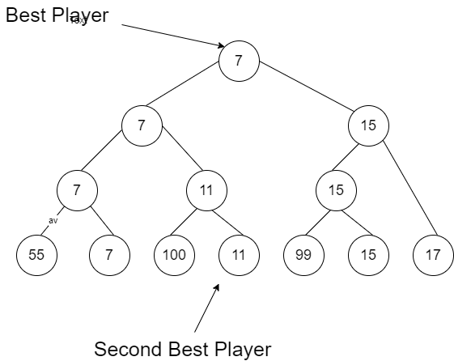

<h1 align="center">Tournament Tree (Winner Tree)  </h1>
<h3 align="center"> Finding the second best player ,in team of N player in minimum comparisons  <h3>
<h4 align="center"> :earth_asia: Demo @ <a href="http://codepad.org/yO18w5qc">http://codepad.org/yO18w5qc</a>   </h4>   

## About 
- ADS Programming Assignment .

### Second Best Player Problem
 ####  :star: Tournament Tree 
   - Tournament tree is a form of min (max) heap which is a complete binary tree. Every external node represents a player and internal node represents winner. In a tournament tree every internal node contains winner and every leaf node contains one player.
 - So the root is the Best Player.
 - An ancestous node is always greater or equal to a descendent one.
 
 #### :star: Second Best Player
  - Given a team of N players. How many minimum games are required to find second best player?
  -  We need to find the second best player in less than 2N comparisions.
  - Approach :star: 
      - After building Tournament tree , root is the best player (minimum), we have to find second best (second min).
      - So , in two children of root , the nodes below Loser node ,will be greater than it, so we cant find second min there.
      - Loser by itself can be the potential second min value if the winner side of the subtree is empty or has large values.
      - So take loser of root as a candidate for second min value and ignore the rest of the loser side tree.
      - Now we look at the winner side , which by itself is a tournament tree with the same winner as root.compare it with loser ,
       if its is larger than loser ,so our Second Min is found ,else apply same approach.
  - No of comparisions required : (N + log  2  N – 2)
  - Time Complexity : (N + log  2  N)
  - Code implemented in C++.
 
 ### Sample Input 
  #### Input = {55, 7, 100,11 ,99, 15, 17} (Also taken in code)
   - between two player , one with smaller value is winner 
   
   
 

  
  

  
  #### Output = Best Player: 7, Second Best Player: 11 :heavy_check_mark:
  
  
   ## How to Use
 -  main.cpp file contain code for this.
 -  Run that file on any c++ compiler.
 -  or Demo at [http://codepad.org/yO18w5qc](http://codepad.org/yO18w5qc)
 
## Author

[Nikhil Sahu](https://nikhilsahu.me/) - [@nikhildsahu](https://github.com/nikhildsahu) 

[https://nikhilsahu.me/](https://nikhilsahu.me/)

